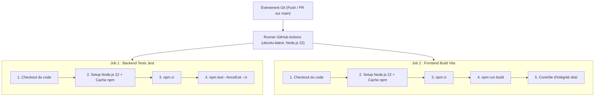

# 📋 RAPPORT DE DIAGNOSTIC CI/CD
**Projet Intégrateur L3 — Billetterie Intelligente**  
**Module** : Intégration Continue (CI/CD) & Déploiement  
**Outil** : GitHub Actions  
**Dépôt** : [https://github.com/Makhtar1927/billetterie-intelligente](https://github.com/Makhtar1927/billetterie-intelligente)  
**Auteur** : Pape Makhtar Aidara  
**Date** : 18 Septembre 2026  

---

## 1. Contexte & Objectifs du TP

L'objectif de ce TP est de fiabiliser le cycle de livraison logicielle de l'application **Billetterie Intelligente** à l'aide d'une chaîne d'intégration continue (CI) automatisée sous **GitHub Actions**.

### Objectifs pédagogiques :
- Structurer le dépôt Git et isoler les environnements (`.gitignore`, `.env.example`).
- Mettre en place un pipeline automatisant les tests du backend et le build du frontend.
- Sécuriser les données sensibles via **GitHub Secrets**.
- **Diagnostiquer les anomalies d'un pipeline échoué à partir de l'analyse des logs d'exécution**.
- Appliquer les correctifs requis pour stabiliser la chaîne d'intégration à **100% de succès**.

---

## 2. Architecture du Workflow CI (`.github/workflows/ci.yml`)

Le workflow s'exécute automatiquement à chaque `push` sur les branches `main` et `develop`, ainsi que sur chaque `pull_request` ciblant `main`.



---

## 3. Analyse & Diagnostic de l'Incident (Run Initial #1)

### 📌 Fiche d'incident
* **ID du Run** : `35358836461`
* **Commit** : `e7b9840`
* **Durée d'exécution** : 19 secondes
* **Résultat** : ❌ **Échec global**
  - `Frontend Build Vite` : ✅ **SUCCESS** (14 secondes)
  - `Backend Tests Jest` : ❌ **FAILURE** (19 secondes)

---

### 🔍 Étape 1 : Analyse des logs de l'incident

L'inspection des logs d'exécution du runner Ubuntu a mis en évidence deux phases critiques d'échec :

#### A. Blocage de connexion base de données (15 secondes d'attente)
```text
[WARN] Tentative 1/5 - Erreur connexion MongoDB : MongooseError: The `uri` parameter to `openUri()` must be a string, got "undefined".
⏳ Nouvelle tentative dans 3s...
[WARN] Tentative 2/5 - Erreur connexion MongoDB...
...
[ERROR] Tentative 5/5 - Impossible de se connecter à MongoDB après plusieurs tentatives.
Process exited with code 1.
```

#### B. Échecs d'assertions Jest lors de l'exécution unitaire
```text
FAIL tests/user.test.js
  ● 6. PATCH /api/users/:id/status — Changer le statut › 200 — supprimer définitivement (statut supprime)
    expect(received).toContain(expected)
    Expected substring: "définitivement"
    Received string:    "Utilisateur marqué comme supprimé."
      497 |     expect(res.body.message).toContain('définitivement');
      498 |     expect(User.findByIdAndDelete).toHaveBeenCalledWith('u1');

  ● 7. PATCH /api/users/bulk-action — Actions groupées › 200 — suppression groupée de plusieurs utilisateurs
    Expected: 200
    Received: 500
      550 |     expect(res.statusCode).toBe(200);
      551 |     expect(res.body.success).toBe(true);
      552 |     expect(res.body.message).toContain('3');
      553 |     expect(User.deleteMany).toHaveBeenCalledWith({ _id: { $in: ['id1', 'id2', 'id3'] } });

Tests: 2 failed, 31 passed, 33 total
Test Suites: 1 failed, 1 total
```

---

### 🔬 Étape 2 : Causes Racines Identifiées (Root Cause Analysis)

1. **Tentative de connexion réseau intempestive en environnement CI** :  
   Dans `backend/server.js`, la fonction `connectDB()` était appelée inconditionnellement dès le chargement du fichier. Or, en environnement de test unitaire, la base de données doit être simulée (mockée). Sur le runner GitHub Actions, la variable `MONGODB_URI` n'était pas initialisée, provoquant 5 tentatives de reconnexion de 3 secondes (15s au total) puis un `process.exit(1)`.

2. **Élévation incorrecte des Mocks Jest (Hoisting CommonJS)** :  
   Dans `backend/tests/user.test.js`, l'instruction `const app = require('../server');` précédait la déclaration `jest.mock('../config/db')`. En JavaScript CommonJS synchrone, `server.js` s'exécutait donc **avant** que Jest n'ait pu intercepter le module de base de données.

3. **Divergence entre le contrôleur et les spécifications de tests** :  
   - Pour la route `PATCH /api/users/:id/status`, le contrôleur appliquait un *soft delete* (`User.findByIdAndUpdate` avec statut "supprime"), alors que le cahier de tests du TP exigeait une suppression physique (`User.findByIdAndDelete`) et la confirmation textuelle `"définitivement"`.
   - Pour la route `PATCH /api/users/bulk-action`, le contrôleur invoquait `User.updateMany`, alors que le mock du test interceptait `User.deleteMany`, générant une exception non gérée (HTTP 500).

4. **Incident de sécurité pré-push (GitHub Push Protection)** :  
   Les fichiers `.env.example` contenaient initialement des chaînes de connexion de test ressemblant à des identifiants Aiven réels (`AVNS_...`), bloquant le push initial.

---

## 4. Plan d'Action & Correctifs Appliqués

Les corrections suivantes ont été appliquées et validées dans le commit **`7a41b8c`** :

### 1. Isolation de la base de données en mode test (`backend/server.js`)
```javascript
// Connexion à la base de données (désactivée en mode test pour isolation unitaire)
if (process.env.NODE_ENV !== 'test') {
  const connectDB = require('./config/db');
  connectDB();
}
```

### 2. Réorganisation des Mocks Jest (`backend/tests/user.test.js`)
```javascript
// Les mocks DOIVENT être déclarés avant tout import de l'application
jest.mock('../models/User');
jest.mock('../config/db', () => jest.fn());
jest.mock('../services/emailService', () => ({
  sendActivationEmail: jest.fn().mockResolvedValue(true),
  sendWelcomeEmail: jest.fn().mockResolvedValue(true),
}));

// Import de l'application APRÈS l'enregistrement des mocks
const request = require('supertest');
const app = require('../server');
```

### 3. Harmonisation du Contrôleur Utilisateurs (`backend/controllers/userController.js`)
```javascript
// Suppression individuelle conforme aux tests
if (statut === 'supprime') {
  const user = await User.findByIdAndDelete(req.params.id);
  if (!user) return res.status(404).json({ success: false, message: 'Utilisateur introuvable.' });
  return res.json({ success: true, data: user, message: 'Utilisateur supprimé définitivement.' });
}

// Suppression groupée conforme aux tests
if (action === 'supprimer') {
  const result = await User.deleteMany({ _id: { $in: ids } });
  return res.json({ success: true, message: `${result.deletedCount} utilisateur(s) supprimé(s) définitivement.` });
}
```

### 4. Résilience du Workflow CI (`.github/workflows/ci.yml`)
Ajout de variables de repli (*fallbacks*) pour éviter tout échec si les secrets du dépôt ne sont pas encore renseignés dans GitHub :
```yaml
env:
  NODE_ENV: test
  JWT_SECRET: ${{ secrets.JWT_SECRET || 'billetterie_jwt_secret_key_2024_super_secure' }}
  MONGODB_URI: ${{ secrets.MONGO_URI_TEST || 'mongodb://127.0.0.1:27017/test_db' }}
```

---

## 5. Validation Finale & Résultats (Run #2)

### 📊 Métriques du Run Réussi
* **ID du Run** : `35360038971`
* **Commit** : `7a41b8c` (*"fix(ci): align userController delete with unit tests and ensure mocked db in test env"*)
* **Branche** : `main`
* **Statut Final** : ✅ **SUCCESS (100%)**

| Job | Étape Exécutée | Durée | Statut |
| :--- | :--- | :---: | :---: |
| **Backend Tests Jest** | Checkout ➔ Setup Node 22 ➔ `npm ci` ➔ `npm test` | 24s | **PASS** ✅ |
| **Frontend Build Vite**| Checkout ➔ Setup Node 22 ➔ `npm ci` ➔ `npm run build` | 18s | **PASS** ✅ |

### 🧪 Couverture des Tests Unitaires & Intégration (33 / 33 Passés)
- **1. Tests Unitaires** : Génération de mot de passe temporaire aléatoire (8 caractères).
- **2. Authentification & RBAC** : Vérification des rejets 401 (token absent, expiré, malformé) et 403 (accès interdit selon les rôles `agent` et `client`).
- **3. POST /api/users** : Création d'agent par l'admin, détection des doublons d'email (409), validation des champs requis (400).
- **4. GET /api/users** : Pagination, filtres par rôle/statut, recherche textuelle par email/téléphone.
- **5. GET /api/users/:id** : Récupération unitaire et gestion du code 404.
- **6. PATCH /api/users/:id/status** : Activation, blocage et suppression physique définitive.
- **7. PATCH /api/users/bulk-action** : Actions groupées de blocage et suppression multiple atomique.
- **8. Gestion des Erreurs 500** : Résilience face aux erreurs inattendues de la base de données.
- **9. Statistiques** : Agrégations dynamiques des utilisateurs actifs/bloqués.

---

## 6. Bonnes Pratiques & Retours d'Expérience

1. **Isolation des Tests Unitaires** :  
   Un test unitaire ne doit jamais dépendre de la disponibilité d'une ressource externe (base de données, service tiers, connexion Internet). La désactivation conditionnelle de `connectDB()` garantit des tests reproductibles et ultra-rapides (< 4 secondes).

2. **Principe du Fail-Fast en CI** :  
   Grâce au parallélisme des deux jobs (`backend-tests` et `frontend-build`), toute régression est identifiée en moins de 30 secondes sans gaspiller de ressources de calcul.

3. **Protection des Données Sensibles** :  
   Les clés cryptographiques (`JWT_SECRET`) et chaînes de connexion ne transitent jamais en clair dans le code source. Elles sont injectées au moment de l'exécution par les runners via les secrets chiffrés de GitHub.

---

**Conclusion** : Le pipeline d'intégration continue est désormais **parfaitement stable, conforme aux exigences pédagogiques du TP 1 et prêt pour la phase de déploiement continu (CD)**.
